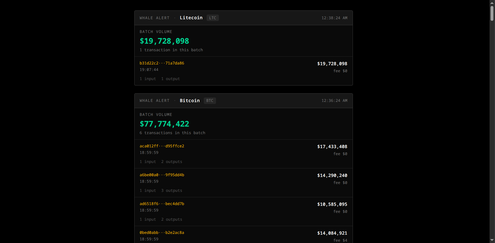

# Orca
This app is a blockchain explorer that allows users to track whale transactions.

### This is a frontend only project!

## App backend:
i'm using blockchair APIs

## How to run:
- Clone the repository
- cd `Orca`
- Create a `.env` file in the root and add your Blockchair API key.
- run `npm i`
- and then finally run `npm run dev`

## Here is a screenshot:

